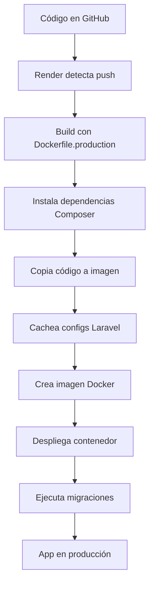

# 🚀 Guía de Despliegue en Render (o cualquier plataforma)

## 📋 Índice
1. [Diferencias entre Desarrollo y Producción](#diferencias-entre-desarrollo-y-producción)
2. [Archivos importantes para producción](#archivos-importantes-para-producción)
3. [Preparar el proyecto para Render](#preparar-el-proyecto-para-render)
4. [Configuración en Render](#configuración-en-render)
5. [Variables de entorno necesarias](#variables-de-entorno-necesarias)
6. [Otras plataformas (Heroku, Railway, Fly.io)](#otras-plataformas)
7. [Solución de problemas](#solución-de-problemas)

---

## 🎯 Diferencias entre Desarrollo y Producción

### En Desarrollo (tu computadora)

**Usas:** [docker-compose.yml](docker-compose.yml) + [dockerfile](dockerfile)

```yaml
# docker-compose.yml (DESARROLLO)
services:
  app:
    build:
      args:
        USER_ID: ${USER_ID:-1000}  # ✅ Sincroniza con tu usuario
        GROUP_ID: ${GROUP_ID:-1000}
    volumes:
      - ./proyectos:/var/www/html:delegated  # ✅ Monta archivos locales
    user: "${USER_ID:-1000}:${GROUP_ID:-1000}"
```

**Características:**
- ✅ Los archivos se montan desde tu máquina (volúmenes)
- ✅ Permisos se ajustan dinámicamente cada vez que inicia
- ✅ Puedes editar código y se refleja inmediatamente
- ✅ Debug activado, logs verbosos

### En Producción (Render, AWS, Railway, etc.)

**Usas:** [Dockerfile.production](Dockerfile.production) SOLAMENTE

```dockerfile
# Dockerfile.production (PRODUCCIÓN)
# NO usa USER_ID ni GROUP_ID
# NO monta volúmenes
# Código COPIADO a la imagen

COPY --chown=www-data:www-data ./proyectos /var/www/html
RUN composer install --no-dev --optimize-autoloader
RUN php artisan config:cache
```

**Características:**
- ✅ Los archivos están DENTRO de la imagen (inmutables)
- ✅ Permisos se configuran UNA VEZ durante el build
- ✅ Optimizaciones de Laravel activadas (cache)
- ✅ Sin dependencias de desarrollo (--no-dev)
- ✅ Debug desactivado

---

## 📁 Archivos importantes para producción

### 1. `.dockerignore` (ya creado)
Evita copiar archivos innecesarios a la imagen de producción:

```bash
node_modules/      # No copiar dependencias locales
vendor/            # Composer las instalará en el build
.env               # Variables de entorno se configuran en Render
.env.docker        # Solo para desarrollo local
.git/              # No necesario en producción
*.md               # Documentación no necesaria
```

**Beneficio:** Imágenes más ligeras y builds más rápidos

### 2. `Dockerfile.production` (ya creado)
Dockerfile optimizado para producción:

```dockerfile
# Sin USER_ID/GROUP_ID
# Usa www-data estándar (UID 33)
# Copia código a la imagen
# Instala dependencias
# Cachea configuraciones
```

**Beneficio:** Build consistente en cualquier plataforma

### 3. `docker-entrypoint.sh` (modificado)
Ahora detecta el entorno:

```bash
if [ "${APP_ENV}" != "production" ]; then
    # Solo en desarrollo: ajusta permisos dinámicamente
else
    # En producción: skip (ya configurados)
fi
```

**Beneficio:** Inicio más rápido en producción

---

## 🛠️ Preparar el proyecto para Render

### Paso 1: Crear `.env.example` en tu proyecto Laravel

```bash
cd proyectos/tu-proyecto-laravel/
cp .env .env.example

# O crear uno nuevo
cat > .env.example << 'EOF'
APP_NAME="Gambeta"
APP_ENV=production
APP_KEY=
APP_DEBUG=false
APP_URL=https://tu-app.onrender.com

DB_CONNECTION=mysql
DB_HOST=
DB_PORT=3306
DB_DATABASE=
DB_USERNAME=
DB_PASSWORD=

FILESYSTEM_DISK=public
QUEUE_CONNECTION=sync
SESSION_DRIVER=file
EOF
```

### Paso 2: Crear `render.yaml` (Blueprint)

Render puede auto-configurarse con este archivo:

```yaml
# render.yaml
services:
  - type: web
    name: gambeta-app
    env: docker
    dockerfilePath: ./Dockerfile.production
    envVars:
      - key: APP_ENV
        value: production
      - key: APP_DEBUG
        value: false
      - key: APP_KEY
        generateValue: true
      - key: DATABASE_URL
        fromDatabase:
          name: gambeta-db
          property: connectionString

databases:
  - name: gambeta-db
    databaseName: gambeta
    user: gambeta_user
```

### Paso 3: Optimizar `Dockerfile.production`

El archivo ya está creado, pero revisa estas secciones clave:

```dockerfile
# Cambiar DocumentRoot a /public
RUN sed -i 's!/var/www/html!/var/www/html/public!g' /etc/apache2/sites-available/000-default.conf

# Instalar solo dependencias de producción
RUN composer install --no-dev --optimize-autoloader --no-interaction

# Cachear configuraciones
RUN php artisan config:cache \
    && php artisan route:cache \
    && php artisan view:cache
```

---

## 🌐 Configuración en Render

### Opción 1: Desde el Dashboard de Render

1. **Conecta tu repositorio de GitHub:**
   - Ve a https://render.com
   - Click en "New +" → "Web Service"
   - Conecta tu repositorio de GitHub

2. **Configuración del servicio:**
   ```
   Name: gambeta-reservaciones
   Environment: Docker
   Dockerfile Path: ./Dockerfile.production
   Instance Type: Free (para empezar)
   ```

3. **Variables de entorno:**
   ```
   APP_NAME=Gambeta
   APP_ENV=production
   APP_DEBUG=false
   APP_KEY=base64:TU_KEY_AQUI
   APP_URL=https://gambeta-reservaciones.onrender.com

   DB_CONNECTION=mysql
   DB_HOST=TU_HOST_MYSQL
   DB_PORT=3306
   DB_DATABASE=gambeta
   DB_USERNAME=tu_usuario
   DB_PASSWORD=tu_password
   ```

4. **Crear base de datos MySQL:**
   - En Render: "New +" → "MySQL"
   - Copia las credenciales a las variables de entorno

### Opción 2: Usando render.yaml (recomendado)

Simplemente haz push del archivo `render.yaml` y Render detectará la configuración automáticamente.

```bash
git add render.yaml Dockerfile.production .dockerignore
git commit -m "Add Render configuration"
git push origin main
```

---

## 🔐 Variables de entorno necesarias

### Variables mínimas requeridas:

| Variable | Valor | Descripción |
|----------|-------|-------------|
| `APP_ENV` | `production` | Entorno de ejecución |
| `APP_DEBUG` | `false` | Desactivar debug en producción |
| `APP_KEY` | `base64:...` | Generar con `php artisan key:generate` |
| `APP_URL` | `https://tu-app.onrender.com` | URL de tu app |
| `DB_CONNECTION` | `mysql` | Driver de base de datos |
| `DB_HOST` | Provisto por Render | Host de MySQL |
| `DB_PORT` | `3306` | Puerto de MySQL |
| `DB_DATABASE` | `gambeta` | Nombre de la base de datos |
| `DB_USERNAME` | Provisto por Render | Usuario de MySQL |
| `DB_PASSWORD` | Provisto por Render | Contraseña de MySQL |

### Generar APP_KEY:

```bash
# En desarrollo, dentro del contenedor
docker-compose exec app php artisan key:generate --show

# Copia el resultado (ej: base64:abc123...)
# Pégalo en Render como variable APP_KEY
```

### Variables opcionales para Gambeta:

```bash
# Para almacenamiento de imágenes de canchas
FILESYSTEM_DISK=public

# Para notificaciones por email (futuro)
MAIL_MAILER=smtp
MAIL_HOST=smtp.gmail.com
MAIL_PORT=587
MAIL_USERNAME=tu-email@gmail.com
MAIL_PASSWORD=tu-app-password
```

---

## 🌍 Otras plataformas

### Railway.app

```bash
# Usa el mismo Dockerfile.production
# En Railway dashboard:
1. New Project → Deploy from GitHub
2. Settings → Variables → Add todas las variables de entorno
3. Settings → Deployment → Dockerfile Path: Dockerfile.production
```

### Heroku

```dockerfile
# Crear Procfile
web: apache2-foreground
```

```bash
heroku create gambeta-app
heroku addons:create jawsdb:kitefin  # MySQL addon
heroku config:set APP_ENV=production APP_DEBUG=false
git push heroku main
```

### Fly.io

```bash
fly launch
# Selecciona región
# Configura MySQL addon
fly secrets set APP_KEY=base64:abc123...
fly deploy
```

### DigitalOcean App Platform

```yaml
# .do/app.yaml
name: gambeta
services:
  - name: web
    dockerfile_path: Dockerfile.production
    envs:
      - key: APP_ENV
        value: production
databases:
  - name: gambeta-db
    engine: MYSQL
```

---

## 🏗️ Flujo completo de despliegue



---

## 🔧 Comandos útiles post-despliegue

### Ejecutar migraciones en Render:

```bash
# Desde Render Dashboard → Shell
php artisan migrate --force

# Con seeds
php artisan migrate:fresh --seed --force
```

### Limpiar caché:

```bash
php artisan config:clear
php artisan cache:clear
php artisan view:clear
```

### Crear enlace simbólico para storage:

```bash
php artisan storage:link
```

---

## 🐛 Solución de problemas

### Error: "Permission denied" en storage/

**Causa:** El Dockerfile.production no configuró permisos correctamente.

**Solución:**
Verifica en [Dockerfile.production](Dockerfile.production) línea 32-36:

```dockerfile
RUN chown -R www-data:www-data /var/www/html \
    && chmod -R 755 /var/www/html \
    && chmod -R 775 /var/www/html/storage \
    && chmod -R 775 /var/www/html/bootstrap/cache
```

### Error: "No application encryption key"

**Causa:** Falta la variable `APP_KEY`.

**Solución:**
```bash
# Generar key localmente
docker-compose exec app php artisan key:generate --show

# Copiar resultado a Render:
# Dashboard → Environment → APP_KEY → base64:abc123...
```

### Error: "SQLSTATE[HY000] [2002] Connection refused"

**Causa:** Variables de base de datos incorrectas.

**Solución:**
Verifica en Render:
- `DB_HOST` apunta al host de MySQL de Render (no `localhost`)
- `DB_PORT` es `3306`
- `DB_USERNAME` y `DB_PASSWORD` son correctos

### Error: "Class 'Livewire\Component' not found"

**Causa:** Las dependencias no se instalaron.

**Solución:**
Asegúrate que `Dockerfile.production` tiene:
```dockerfile
RUN composer install --no-dev --optimize-autoloader --no-interaction
```

### Build muy lento en Render

**Causa:** No estás usando `.dockerignore`.

**Solución:**
Verifica que [.dockerignore](.dockerignore) existe y excluye:
```
node_modules/
vendor/
.git/
```

---

## 📊 Comparación de costos (2024)

| Plataforma | Free Tier | Paid Tier | MySQL Incluido |
|------------|-----------|-----------|----------------|
| **Render** | ✅ 750hrs/mes | $7/mes | ❌ $7/mes extra |
| **Railway** | ✅ $5 crédito | $5+ uso | ✅ Dentro del crédito |
| **Fly.io** | ✅ Limitado | $2+ uso | ✅ Incluido |
| **Heroku** | ❌ Ya no existe | $7/mes | ❌ $9/mes (JawsDB) |

**Recomendación para Gambeta:** Railway o Fly.io (incluyen MySQL gratis)

---

## ✅ Checklist de despliegue

Antes de hacer push a producción:

- [ ] `.env.example` está actualizado
- [ ] `Dockerfile.production` apunta a `/public` como DocumentRoot
- [ ] `.dockerignore` excluye archivos innecesarios
- [ ] Todas las migraciones están commiteadas
- [ ] Seeds de datos iniciales están listos
- [ ] Variables de entorno configuradas en Render
- [ ] Base de datos MySQL creada
- [ ] `APP_KEY` generada y configurada
- [ ] Storage link configurado (`php artisan storage:link`)
- [ ] Imágenes de ejemplo de canchas cargadas

---

## 🎓 Resumen para el equipo

### Para desarrollo local (NO cambiar):
```bash
docker-compose up -d  # Usa docker-compose.yml + dockerfile
```

### Para producción en Render:
```bash
# Render usa automáticamente Dockerfile.production
# Solo necesitas:
1. Push a GitHub
2. Conectar repo en Render
3. Configurar variables de entorno
4. Deploy automático
```

### Diferencia clave:

| | Desarrollo | Producción |
|---|------------|------------|
| **Archivo** | `docker-compose.yml` + `dockerfile` | `Dockerfile.production` |
| **UID/GID** | ✅ Sincronizado con tu usuario | ❌ No necesario |
| **Volúmenes** | ✅ Monta `./proyectos` | ❌ Código en imagen |
| **Permisos** | 🔄 Dinámicos (cada inicio) | ✅ Estáticos (en build) |
| **Debug** | ✅ Activado | ❌ Desactivado |

---

## 🚀 ¿Listo para producción?

1. **Sube tu código a GitHub:**
```bash
git add .
git commit -m "Preparar para producción"
git push origin main
```

2. **Conecta con Render:**
- https://render.com → New Web Service
- Conecta repositorio
- Selecciona `Dockerfile.production`

3. **Configura variables:**
- Copia todas las variables de la sección anterior

4. **¡Deploy! 🎉**
- Render construirá y desplegará automáticamente

---

*Documentación para el proyecto Gambeta - Sistema de Reservación de Canchas Deportivas*
